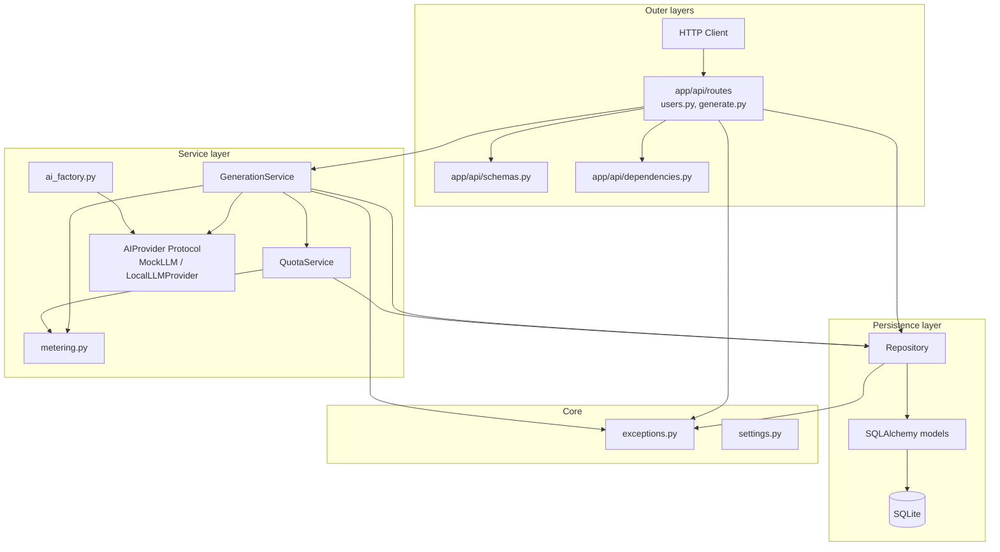
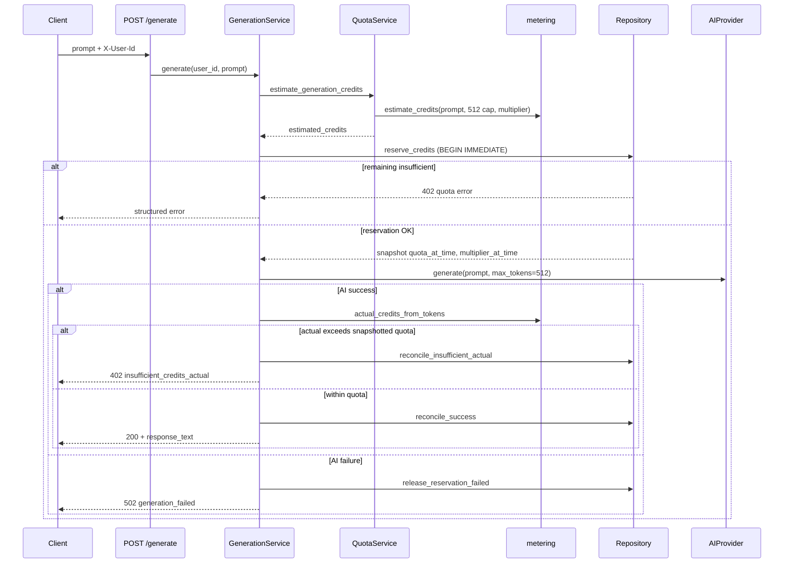

# Design: AI Usage Metering and Quota Service

## Overview

This service meters AI text generation against per-user credit quotas. Clients register users, configure quota allowances and multipliers, and call a generate endpoint that returns model output while tracking token usage and remaining credits.

The core problem is **consistent billing under uncertainty**: token counts are unknown until after generation, yet the system must reject over-quota requests before calling the model when possible, handle concurrent requests safely, and reconcile actual usage against snapshotted quota at reservation time.

The implementation follows **clean architecture**: HTTP concerns stay in the API layer, business rules live in services, and all SQL runs through a repository. Dependencies point inward; outer layers depend on inner abstractions, never the reverse.

---

## Architecture

### Layered structure



### Generate request flow



### Dependency rule

| Layer | Package | Depends on |
|-------|---------|------------|
| API | `app/api/` | services, repository (via DI), schemas, core exceptions |
| Services | `app/services/` | repository, metering (pure functions), AIProvider Protocol |
| Repository | `app/db/repository.py` | models, core exceptions |
| Models / DB | `app/db/` | SQLAlchemy only |
| Core | `app/core/` | nothing in app |

Routes never import SQLAlchemy models directly for business logic. `GenerationService` orchestrates quota and AI calls but does not execute SQL. The repository is the single gateway to persistence.

---

## Layer responsibilities

### API (`app/api/`)

- **Routes** (`routes/users.py`, `routes/generate.py`): map HTTP verbs to service or repository calls; validate bodies with Pydantic schemas.
- **Dependencies** (`dependencies.py`): extract and validate `X-User-Id` (UUID format); verify user exists via repository.
- **Schemas** (`schemas.py`): request/response contracts and shared `ErrorResponse` shape.

### Services (`app/services/`)

| Module | Responsibility |
|--------|----------------|
| `generation.py` | Orchestrates estimate → reserve → AI call → reconcile; handles AI failure paths |
| `quota.py` | Loads user config; delegates credit estimation to metering |
| `metering.py` | Pure token/credit math (word-split estimates, ceil billing) |
| `ai_provider.py` | `AIProvider` Protocol, `MockLLM`, result/failure types |
| `local_llm.py` | HuggingFace Qwen provider with lazy model load |
| `ai_factory.py` | `create_ai_provider()` selects mock or local based on settings |

### Repository (`app/db/repository.py`)

All transactional quota operations: user CRUD, config upsert, usage summary, credit reservation (`BEGIN IMMEDIATE`), success/failure reconciliation, usage history queries.

### Database (`app/db/`)

- **models.py**: SQLAlchemy ORM definitions and FK relationships.
- **session.py**: engine, session factory, `init_db()` on startup.
- **schema_sync.py**: lightweight column/index migration for existing SQLite files.

---

## API design

Base path: `/api/v1`. User identity is passed via the **`X-User-Id`** header (UUID string), not in URL paths.

### Endpoints

| Method | Path | Auth header | Description |
|--------|------|-------------|-------------|
| `POST` | `/users` | none | Register user with `name` and `email` |
| `PUT` | `/config` | `X-User-Id` | Add quota credits and set multiplier |
| `GET` | `/usage` | `X-User-Id` | Current quota and balance summary |
| `GET` | `/usage/history` | `X-User-Id` | Paginated audit records |
| `POST` | `/generate` | `X-User-Id` | Generate text and meter credits |

### POST /users

Request:

```json
{ "name": "Alice", "email": "alice@example.com" }
```

Response `201`:

```json
{
  "user_id": "550e8400-e29b-41d4-a716-446655440000",
  "name": "Alice",
  "email": "alice@example.com",
  "created_at": "2026-06-29T12:00:00Z"
}
```

Creates a `users` row and initializes `user_balances` (`credits_used=0`, `credits_reserved=0`). Email is validated with Pydantic `EmailStr`.

### PUT /config

Request:

```json
{ "quota_credits": 100, "credit_multiplier": 0.5 }
```

Response `200`:

```json
{
  "user_id": "550e8400-e29b-41d4-a716-446655440000",
  "quota_credits": 100,
  "credits_added": 100,
  "credit_multiplier": 0.5,
  "updated_at": "2026-06-29T12:00:00Z"
}
```

See [Quota configuration](#quota-configuration) for add-vs-replace semantics.

### GET /usage

Response `200`:

```json
{
  "user_id": "550e8400-e29b-41d4-a716-446655440000",
  "quota": 100,
  "multiplier": 0.5,
  "credits_used": 40,
  "credits_reserved": 0,
  "credits_remaining": 60
}
```

`credits_remaining = quota - credits_used - credits_reserved`.

### GET /usage/history

Query params: `limit` (1-200, default 50), `offset` (default 0).

Response `200`:

```json
{
  "records": [
    {
      "id": 1,
      "user_id": "550e8400-e29b-41d4-a716-446655440000",
      "prompt": "hello world",
      "response": "Echo: hello world",
      "prompt_tokens": 2,
      "completion_tokens": 3,
      "total_tokens": 5,
      "estimated_credits": 257,
      "actual_credits": 5,
      "multiplier_at_time": 1.0,
      "quota_at_time": 600,
      "operation_type": "generate",
      "status": "succeeded",
      "created_at": "2026-06-29T12:01:00Z"
    }
  ],
  "limit": 50,
  "offset": 0
}
```

### POST /generate

Request body contains **`prompt` only** (no `max_completion_tokens` on the API). An internal cap of 512 tokens is used for estimation and passed to the model.

Request:

```json
{ "prompt": "hello world" }
```

Response `200`:

```json
{
  "response_text": "Echo: hello world",
  "prompt_tokens": 2,
  "completion_tokens": 3,
  "total_tokens": 5,
  "estimated_credits": 257,
  "actual_credits": 5,
  "credits_remaining": 595,
  "usage_record_id": 1
}
```

### Error responses

All application errors use a consistent shape:

```json
{
  "error_code": "insufficient_credits_estimated",
  "message": "Insufficient credits (estimated)",
  "details": { "credits_remaining": 20, "credits_required": 261 }
}
```

| Situation | HTTP | error_code |
|-----------|------|------------|
| Success | 200 / 201 | n/a |
| Duplicate email | 409 | `duplicate_email` |
| User not found | 404 | `user_not_found` |
| User not configured | 404 | `user_not_configured` |
| No credits remaining | 402 | `quota_exceeded` |
| Estimate exceeds remaining | 402 | `insufficient_credits_estimated` |
| Actual usage exceeds snapshotted quota | 402 | `insufficient_credits_actual` |
| AI failure | 502 | `generation_failed` |
| Missing/invalid UUID header | 422 | `invalid_user_id` |
| Pydantic validation | 422 | FastAPI default |

---

## User model

| Column | Type | Notes |
|--------|------|-------|
| `id` | UUID string PK | Server-generated on registration |
| `name` | string | Required, min length 1 |
| `email` | string | Unique, validated email |
| `created_at` | datetime UTC | Set on insert |

Registration flow:

1. `POST /api/v1/users` with `name` and `email`.
2. Repository checks email uniqueness; returns `409 duplicate_email` on conflict.
3. Creates `users` row and empty `user_balances` row.
4. Client stores returned `user_id` and sends it as `X-User-Id` on subsequent calls.
5. Quota config is applied separately via `PUT /config`.

Related tables reference `users.id` via foreign keys: `user_configs`, `user_balances`, `usage_records`, `reservations`.

---

## Credit calculation model

### Pre-request estimate (conservative)

Uses word-split prompt tokenization plus a fixed internal completion cap of **512 tokens** (`DEFAULT_MAX_COMPLETION_TOKENS`). This cap is not exposed on the API; it bounds reservation size and is passed to the model as `max_new_tokens`.

```python
prompt_tokens = len(prompt.split())
estimated_tokens = prompt_tokens + 512
estimated_credits = ceil(estimated_tokens * credit_multiplier)
```

### Actual billing (post-generation)

Token counts come from the active `AIProvider`:

| Provider | Token counting |
|----------|----------------|
| `mock` | Word splitting (deterministic for tests) |
| `local` | HuggingFace tokenizer `encode` length |

```python
actual_credits = ceil(total_tokens * multiplier_at_time)
```

Actual credits use the **multiplier snapshotted at reservation time**, not the live config value.

Billing charges **actual** credits on success, not the estimate. Estimates are intentionally conservative so early rejection is safe.

---

## Quota model

### Configuration semantics

**`quota_credits` adds** to the allowance; it does not replace the total.

| Case | Behavior |
|------|----------|
| First config (no row) | `new_quota = quota_credits` |
| Subsequent updates | `new_quota = existing_quota + quota_credits` |
| `credit_multiplier` | **Replaces** current multiplier for future requests |
| `credits_used` | Unchanged by config updates |

Example: quota=100, used=40, `PUT { "quota_credits": 10, "credit_multiplier": 1.0 }` → quota=110, used=40, remaining=70.

### Estimate → reserve → reconcile

1. **Estimate**: `QuotaService` loads config; `metering.estimate_credits` computes reservation size.
2. **Reserve** (inside `BEGIN IMMEDIATE`):
   - `remaining = quota - credits_used - credits_reserved`
   - Reject if `remaining <= 0` (`quota_exceeded`) or `remaining < estimated_credits` (`insufficient_credits_estimated`)
   - Insert pending `usage_record` with `multiplier_at_time` and `quota_at_time` snapshots
   - Insert `reservation`; increment `credits_reserved`
3. **Generate**: call `AIProvider.generate(prompt, 512)`.
4. **Reconcile**:
   - Compute `actual_credits` with snapshotted multiplier
   - If `credits_used + actual_credits > quota_at_time`: reject with `402 insufficient_credits_actual`; no response text; audit record kept; reservation released
   - Else: charge `actual_credits`, release reservation, mark record `succeeded`, return response

---

## Consistency Challenge

Four scenarios from the assignment, with numbers matching `tests/test_quota.py` and related tests.

### Scenario 1: Affordable before generation, actual differs from estimate

**Policy:** Run generation when the estimate passes reservation. After AI returns, reconcile against snapshotted quota. Charge actual credits on success; reject without returning text if actual pushes total over `quota_at_time`.

#### Walkthrough A: Bob (success)

| Step | Value |
|------|-------|
| Config | quota=600, multiplier=1.0 |
| Balance | used=30, reserved=0, remaining=570 |
| Prompt | 10 words ("one two ... ten") |
| Estimate | tokens=10+512=522; credits=522 |
| Reserve | 522 ≤ 570: passes; reserved=522 |
| AI result | `fixed_total_tokens=45` → actual_credits=45 |
| Reconcile | 30 + 45 = 75 ≤ 600 |
| Outcome | **200 OK**; used=75, reserved=0, remaining=525 |

#### Walkthrough B: Carol (post-generation reject)

| Step | Value |
|------|-------|
| Config | quota=600, multiplier=1.0 |
| Balance | used=10, reserved=0, remaining=590 |
| Prompt | 5 words |
| Estimate | tokens=5+512=517; credits=517 |
| Reserve | 517 ≤ 590: passes; reserved=517 |
| AI result | 591 total tokens → actual_credits=591 |
| Reconcile | 10 + 591 = 601 > 600 |
| Outcome | **402 insufficient_credits_actual**; no `response_text`; audit record with tokens preserved; used stays 10; reserved=0 |

### Scenario 2: Rejected because estimate exceeds remaining

**Policy:** Pre-check before AI. No reservation, no model call.

#### Walkthrough: Alice (estimate reject)

| Step | Value |
|------|-------|
| Config | quota=100, multiplier=0.5 |
| Balance | used=80, reserved=0, remaining=20 |
| Prompt | 10 words |
| Estimate | tokens=522; credits=ceil(522 × 0.5)=**261** |
| Pre-check | 20 < 261 |
| Outcome | **402 insufficient_credits_estimated**; AI never called; used=80 unchanged |

### Scenario 3: Concurrent requests for the same user

**Policy:** `BEGIN IMMEDIATE` serializes reservation transactions. The second request sees updated `credits_reserved`.

**Example (Dave):**

| Step | Value |
|------|-------|
| Config | quota=1000, multiplier=1.0 |
| Balance | used=485, reserved=0, remaining=515 |
| Prompt | "one two" → estimate=514 credits |
| Request A (wins lock) | reserves 514; reserved=514; remaining for B=1 |
| Request B (concurrent) | 514 > 1 → **402 insufficient_credits_estimated** |
| Request A completes | charges actual (small echo); reserved=0 |

Verified in `tests/test_concurrency.py` with two threads against a file-backed SQLite database.

### Scenario 4: Quota or multiplier updated mid-flight

**Policy:** Snapshots at reservation time govern reconciliation. Config changes apply to future requests only. Historical records are immutable.

**Multiplier change (Eve):**

| Event | Detail |
|-------|--------|
| Request at 0.5× | 100 tokens → 50 credits; record stores `multiplier_at_time=0.5` |
| `PUT /config` | multiplier=1.0 (quota_credits=0 adds nothing) |
| Next request | 100 tokens → 100 credits; new record stores `multiplier_at_time=1.0` |
| History | Old record still shows 50 credits at 0.5 |

**Quota add during in-flight request (Frank):**

| Event | Detail |
|-------|--------|
| Start | quota=100, used=60; reservation snapshot `quota_at_time=100` |
| Admin | `PUT /config` adds 50 → live quota=150 |
| Reconcile | Uses snapshot 100; 60 + 30 actual = 90 ≤ 100: succeeds |
| After | used=90, live quota=150, remaining=60; new requests use 150 |

---

## Persistence

### SQLite choice

- Single file (`ai_quota.db` by default), zero external infra, easy reviewer setup
- Durable append-only `usage_records` for audit
- `BEGIN IMMEDIATE` provides write locking for same-user concurrency
- `PRAGMA foreign_keys=ON` and `busy_timeout=5000` set on connect

### Schema

| Table | Purpose |
|-------|---------|
| `users` | Identity: id, name, email (unique), created_at |
| `user_configs` | quota_credits, credit_multiplier (FK → users.id) |
| `user_balances` | credits_used, credits_reserved, version (FK → users.id) |
| `usage_records` | Append-only audit log with snapshots (FK → users.id) |
| `reservations` | In-flight credit holds linked to usage_record (FK → users.id, usage_records.id) |

### Schema sync

`schema_sync.py` runs after `create_all()` on startup. SQLAlchemy `create_all()` does not alter existing tables, so the sync module adds missing columns (e.g. `users.name`, `users.email`) and ensures a unique index on email. This keeps older local `.db` files working without Alembic.

### Tradeoffs vs Postgres

| Aspect | SQLite (current) | Postgres (production) |
|--------|------------------|----------------------|
| Setup | File-based, no server | Requires connection pool, migrations |
| Concurrency | `BEGIN IMMEDIATE` table lock | `SELECT ... FOR UPDATE` row locks |
| Scale | Single writer | Multi-node, replication |
| Migration | Lightweight sync | Alembic recommended |

The repository interface stays the same; only session/lock primitives change.

---

## Failure handling

| Case | Behavior |
|------|----------|
| AI fails before usage (`AIFailure`) | Release full reservation; record status `failed_pre_usage`; 502; zero credits charged |
| AI fails after partial usage (`AIPartialFailure`) | Charge partial `actual_credits` if within snapshotted quota; record status `failed_partial`; 502 with `charged_credits` in details |
| Partial usage would exceed snapshotted quota | Release reservation without charge; 502 |
| Estimate too high | 402 before AI; no reservation |
| Actual over quota after generation | 402; no response text; audit record with token counts |

Structured errors are raised as `AppError` subclasses in `app/core/exceptions.py` and converted to JSON by a global FastAPI exception handler in `app/main.py`.

Mock failure headers for demos (`X-Mock-Fail-Before-Usage`, `X-Mock-Fail-After-Partial`, `X-Mock-High-Tokens`) activate `MockLLM` options when `AI_PROVIDER=mock`, or on any request that sends a mock header while running the local provider.

---

## Concurrency

Reservation runs inside a SQLite immediate transaction:

1. `BEGIN IMMEDIATE` (acquires write lock before reads)
2. Load config and balance
3. Validate `remaining` against `estimated_credits`
4. Insert `usage_record` and `reservation`; increment `credits_reserved`
5. Commit

This prevents two near-simultaneous requests from both passing a stale pre-check. Each request uses its own SQLAlchemy session; the lock is at the database level.

`user_balances.version` increments on each balance mutation for potential optimistic-lock extensions.

---

## AI provider

### Protocol and factory

```python
class AIProvider(Protocol):
    def generate(self, prompt: str, max_completion_tokens: int) -> GenerationResult: ...
```

`create_ai_provider()` in `ai_factory.py` reads `AI_PROVIDER` env var:

| Value | Implementation | Notes |
|-------|----------------|-------|
| `local` (default) | `LocalLLMProvider` | Qwen via HuggingFace; lazy load; tokenizer-accurate counts |
| `mock` | `MockLLM` | Deterministic echo; used by pytest |
| unknown | raises `ValueError` at startup | |

If `local` is selected but `transformers`/`torch` are missing, the factory logs a warning and falls back to `MockLLM`.

Default model: `Qwen/Qwen2.5-0.5B-Instruct` (`AI_MODEL_NAME` env var).

### LocalLLMProvider

- Thread-safe lazy model cache (`lru_cache` + lock)
- Chat template when available
- Token counts from tokenizer encode/decode; trims trailing EOS/pad tokens

### MockLLM

- Echo response truncated to `max_completion_tokens`
- Options for fixed token counts, high token overrun, and failure injection
- Enables full test coverage without model downloads

---

## Future extensibility

| Change | Extension point today | Later work |
|--------|----------------------|------------|
| New AI endpoints | `GenerationService.generate(..., operation_type=...)` | New routes call same orchestrator |
| Swap AI backend | `AIProvider` Protocol + factory | e.g. `OpenAIProvider`; env-driven selection |
| Real database | All SQL in `Repository` | Postgres URL, Alembic, row-level locks |
| Quota periods / plans | `user_configs` table + repository methods | `plan_id`, period boundaries, reset job |
| Billing audit export | Append-only `usage_records` + history API | Export pipeline, correlation IDs |

Key files for a walkthrough:

1. `app/services/ai_provider.py` (Protocol)
2. `app/services/local_llm.py` (Qwen integration)
3. `app/services/ai_factory.py` (provider selection)
4. `app/db/repository.py` (transactions and quota logic)
5. `app/services/generation.py` (orchestration)

---

## Testing strategy

**96 pytest tests** across 11 files. All HTTP tests run with `AI_PROVIDER=mock` (autouse fixture in `conftest.py`).

| File | Focus | Tests |
|------|-------|-------|
| `test_quota.py` | Consistency Challenge scenarios 1-4 | 6 |
| `test_concurrency.py` | Scenario 3 with threaded SQLite file DB | 1 |
| `test_generation.py` | End-to-end flows, boundaries, auth headers | 20 |
| `test_generate_api.py` | Generate endpoint contracts and error shapes | 17 |
| `test_config_api.py` | Config, usage, history endpoints | 18 |
| `test_users_api.py` | User registration validation | 9 |
| `test_failures.py` | AI pre/partial failure paths | 3 |
| `test_metering.py` | Credit math unit tests | 10 |
| `test_ai_provider.py` | MockLLM behavior | 6 |
| `test_ai_factory.py` | Provider factory | 4 |
| `test_db_schema.py` | Schema sync idempotency | 2 |

### Test infrastructure

- In-memory SQLite with `StaticPool` for isolation per test
- `injectable_client` fixture overrides `get_ai_provider` to inject `MockLLM` with scenario options (`fixed_total_tokens`, failure flags)
- `configure_user` / `seed_user` helpers set up named scenario users (Alice, Bob, Carol, Dave, Eve, Frank)
- Repository-level tests call `reserve_credits` / `reconcile_success` directly where orchestration edge cases need precise control

Run: `pytest` (or `pip install -e ".[dev]"` first).

---

## Edge-case policy summary

| Case | Behavior |
|------|----------|
| User not registered | 404 `user_not_found` |
| No quota config | 404 `user_not_configured` |
| Already exhausted (`remaining <= 0`) | 402 `quota_exceeded` |
| Estimate too high | 402 before AI |
| Success | Charge actual; return text |
| AI fails pre-usage | Release reservation; 502 |
| AI fails partial | Partial charge if affordable; 502 |
| Multiplier changed mid-flight | Snapshot at reservation |
| Quota added while reserved | In-flight honors snapshot; new requests use updated total |
| Concurrent requests | `BEGIN IMMEDIATE` reservation serialization |
| At-quota boundary | `remaining >= estimated_credits` allows; `remaining == 0` rejects |
